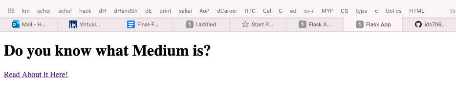
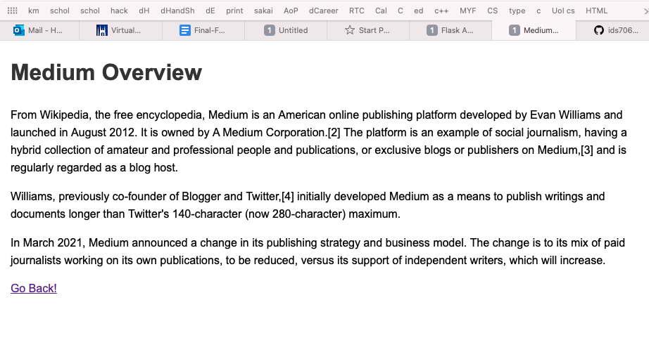
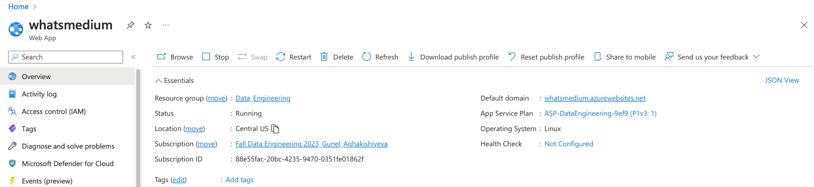
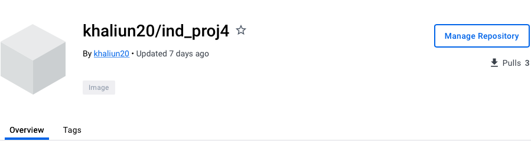

# Simple Flask App 

## Demo Video

Link to the demo video:

https://www.youtube.com/watch?v=IHwH8tfzy6Q

## Project Overview

In this project, I aimed to learn the basics of web development with Flask and Azure. The Flask app was built and containerized. It is then pushed to DockerHub so that I can deploy the image from Dockerhub using Azure. 

I created simple two page web server that renders texts on both pages

## Installation & Run 

* git clone the repository

* docker build -t app:app .

* docker run -p 5000:5000 app:app

## CI/CD

Following are available: 

* make lint
* make test
* make format

## Azure and DockerHub

Due to lack of credit in class Azure credit, I was not able to deploy the app on my account. However, a classmate of mine offered to host my on her account. 

Azure: 

DockerHub: 

